# FundOffice

FundOffice 是面向私募基金管理人的中台运营桌面系统，连接管理人内部数据、托管外包、基金业协会、电子签约平台和自动化任务。主程序是基于 WPF 的 Windows 客户端，程序集名为 `Thor`。

仓库地址：[https://github.com/iyumot/FundMiddleOffice](https://github.com/iyumot/FundMiddleOffice)

## 核心能力

### 产品与运营数据

- 汇总基金基础信息、份额、账户、合同要素、净值、开放日、TA 交易申请与确认等数据。
- 从托管邮件或托管 API 同步估值表、TA 报表、募集户余额、基金费用等运营数据。
- 对净值缺失、份额异常、费用异常、申赎未到账、清算未完成等场景进行提醒。

### 平台对接

- 托管外包：支持招商证券、中信证券、中信建投、兴业证券等托管接口或数据源。
- 基金业协会：支持管理人、员工、基金公开信息等数据同步与辅助处理。
- 电子签约：提供签约核心框架，并接入美市科技等平台。
- 信息披露：支持邮件、协会、季度更新、PFID 等披露通道配置与执行。

### 自动化与工具

- 自动从邮件缓存更新估值表和 TA 数据。
- 自动生成每日净值报表、模板化报表和运营提醒。
- 提供费用计算器 [演示费用表格](https://github.com/FundOffice/FundOffice/blob/master/readme/feecalc.png)
- AI 尽调
- AI 宣传材料生成  [演示文件](https://github.com/FundOffice/FundOffice/blob/master/readme/演示基金9号.png)
- 协会学习辅助（自动答题）
- 支持插件化扩展、任务调度、待办事项、数据触发器和源码生成器。


## 项目结构

```text
FundOffice.slnx
├── src/
│   ├── Client/        # WPF 客户端入口，输出 Thor.exe
│   ├── Main/          # 核心领域模型、DataHub、AI 文档解析、分析器与生成器
│   ├── Trustee/       # 托管机构对接：招商、中信、中信建投、兴业等
│   ├── Amac/          # 基金业协会直连、公开数据、RPA
│   ├── Disclosure/    # 信息披露核心服务与 UI
│   ├── ESign/         # 电子签约核心框架与平台接入
│   ├── Schedule/      # 任务调度、后台任务和预定义任务
│   ├── Trigger/       # 数据触发器、校验规则和监控规则
│   ├── Todo/          # 待办事项系统
│   ├── Setting/       # 设置服务、设置 UI 与注册生成器
│   ├── Templates/     # 报表导出模板
│   ├── Plugin/        # 插件系统
│   ├── SharedUI/      # 共享 WPF 控件与可编辑视图模型
│   ├── Utility/       # 通用工具、文件模板、OCR、PDF、补丁、源码生成器
│   ├── AI/            # Copilot / LLM Provider 抽象
│   └── Tools/         # 独立工具，如费用计算器、数据库查看器、启动器
├── test/              # MSTest 测试项目
├── readme/            # 模块说明文档与截图
└── publish.ps1        # 发布脚本
```

更完整的架构说明见 [readme/Architecture.md](readme/Architecture.md)。
 


## 功能预览

### 首页

首页聚合历史规模、常用工具、业务提示和托管提示。

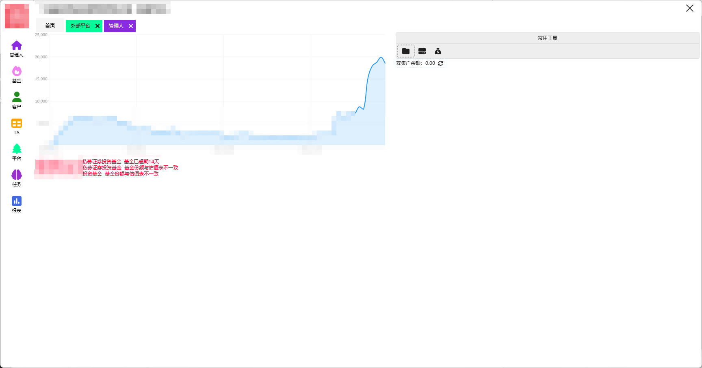

### 管理人

支持管理人基础信息、成员、证件、股权结构等数据管理，部分信息可从协会同步。

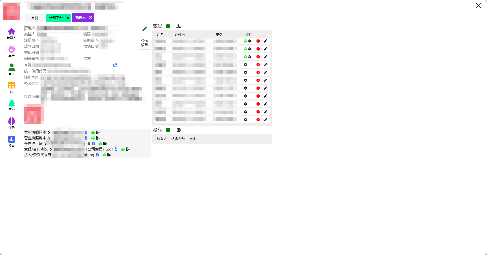

### 基金

支持基金列表、协会数据更新、净值、曲线、合同要素、账户、开放日和产品生命周期管理。

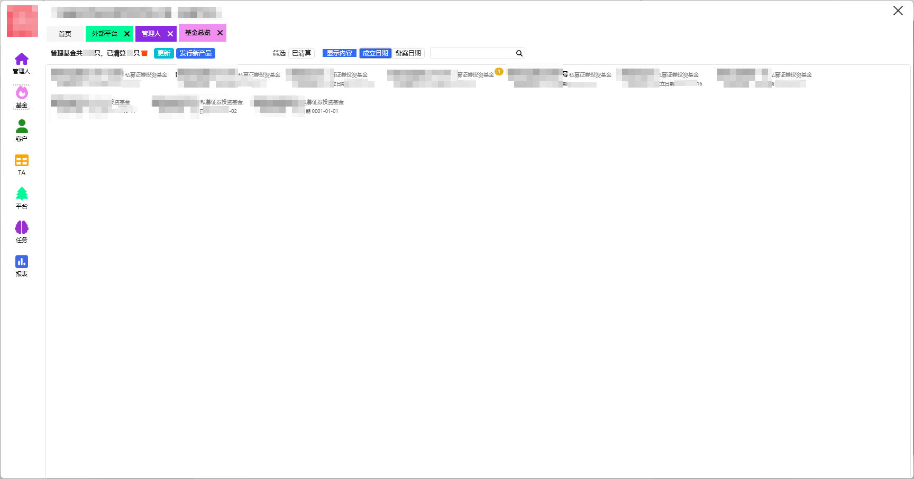

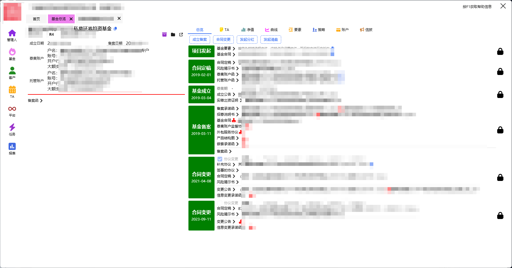

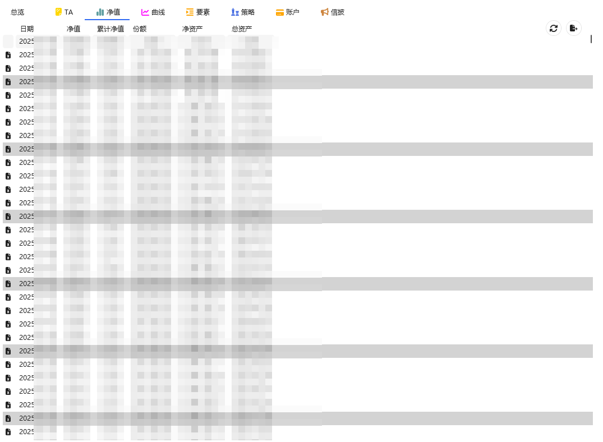

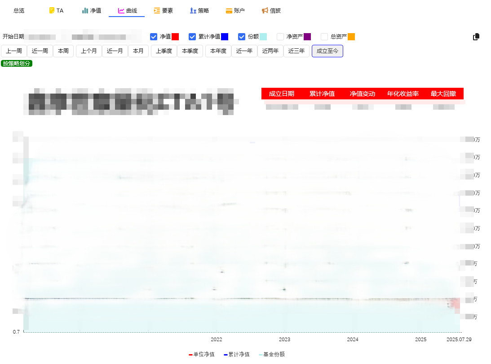

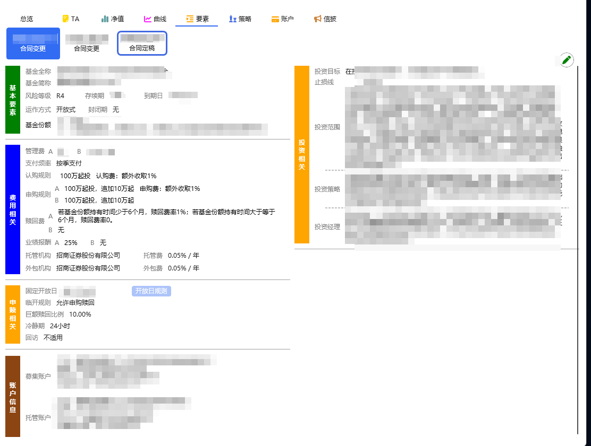

### 客户与 TA

汇总投资人信息、合格投资者资料、TA 交易申请与确认，并可对接托管和电签平台同步数据。

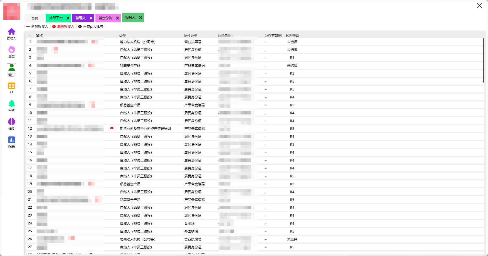

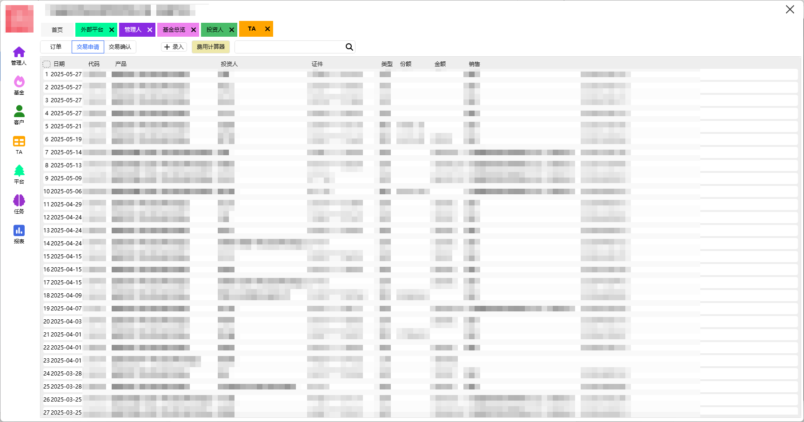

### 平台与任务

统一管理协会、托管外包、电签平台等外部系统配置，并通过任务调度执行数据同步、报表生成和提醒。

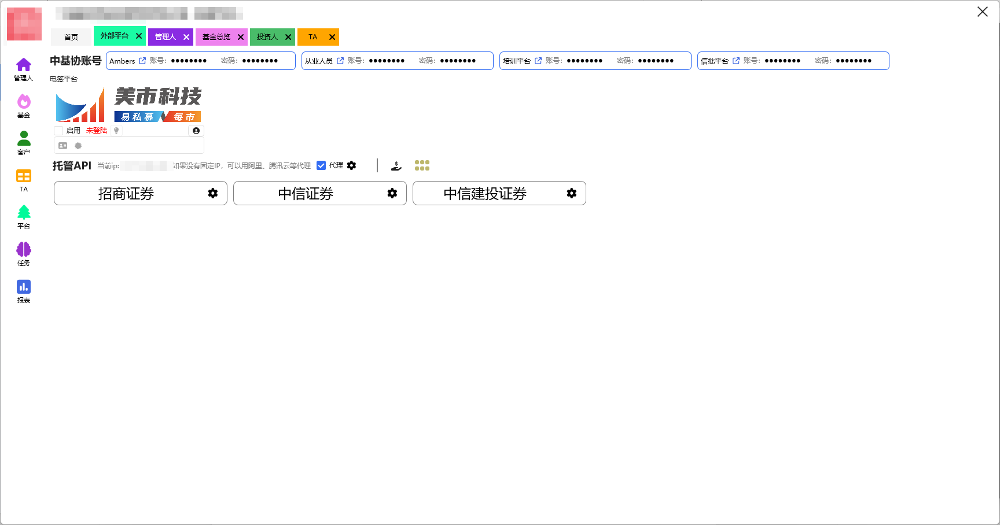

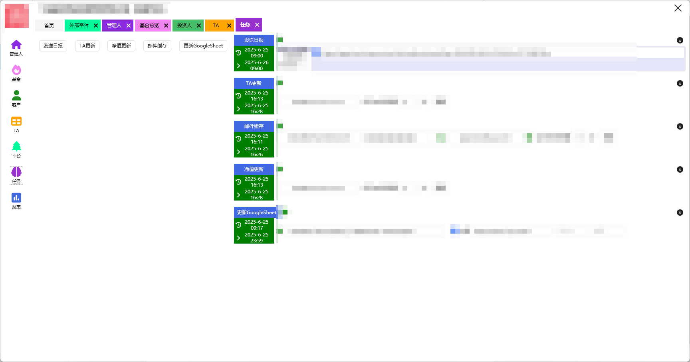

### 报表

支持每日净值报表和基于模板的定制化导出。

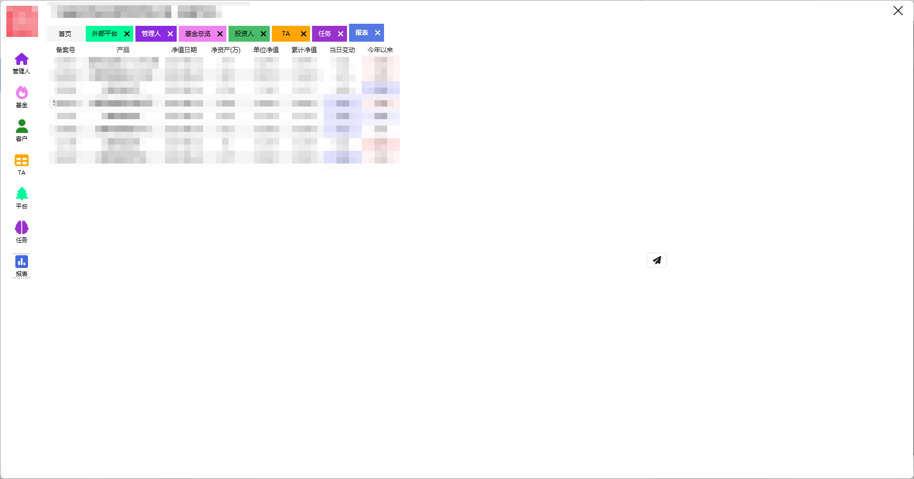

