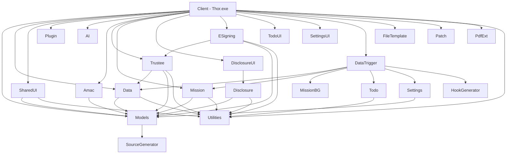

# FundOffice 解决方案架构总览

## 项目简介

FundOffice（程序集名 Thor）是一套**私募基金中台管理系统**，基于 WPF 桌面应用，面向基金管理人的日常运营，覆盖基金信息管理、投资者管理、信披合规、电签平台对接、托管行数据同步、定时任务调度等核心业务场景。

## 技术栈

| 类别 | 技术 |
|------|------|
| 框架 | .NET 10 / WPF (net10.0-windows) |
| UI 框架 | HandyControl、OxyPlot（图表）、Microsoft.Xaml.Behaviors |
| MVVM | CommunityToolkit.Mvvm |
| 数据库 | LiteDB（嵌入式 NoSQL） |
| Excel/Word | ClosedXML、MiniExcel、MiniWord、DocumentFormat.OpenXml |
| PDF | PDFiumSharp |
| OCR | PaddleOCR (Sdcb) |
| 日志 | MoT.Logg + Serilog |
| 代码生成 | Roslyn Source Generator (多个) |
| 浏览器自动化 | Microsoft.Playwright |

## 解决方案结构

```
FundOffice.slnx
├── Main/                  # 核心业务层
│   ├── Models             # 领域模型（基金、投资者、管理人、TA等）
│   ├── Data               # 数据中心 DataHub（事件总线 + Hook机制）
│   ├── AI                 # AI文档解析（多LLM提供商）
│   ├── HookableGenerator  # Hookable属性源码生成器
│   └── CustomAnalyzer     # Roslyn分析器（ViewModel校验）
│
├── Client/                # WPF客户端入口（Thor.exe）
│   ├── Views              # 页面视图（基金、投资者、管理人、信披等）
│   ├── ViewModel          # 视图模型（Elements、Flow、Home等）
│   └── Controls           # 自定义控件
│
├── Amac/                  # 中基协对接
│   ├── Direct             # 直连上报
│   ├── Public             # 公开数据爬取
│   └── RPA                # RPA自动化操作
│
├── Trustee/               # 托管机构对接
│   ├── Trustee            # 托管基类 + Worker
│   ├── CITICS             # 中信证券
│   ├── CMS                # 招商证券
│   ├── CSC                # 中信建投
│   └── XYZQ               # 兴业证券
│
├── Schedule/              # 任务调度系统
│   ├── Mission            # 任务框架（Mission基类 + Schedule）
│   ├── Mission.Background # 后台任务实现
│   ├── Mission.Predefined # 预定义任务
│   └── MissionRegisterGenerator # 任务注册源码生成器
│
├── Disclosure/            # 信息披露系统
│   ├── Disclosure         # 信披服务核心 + 通道
│   └── Disclosure.UI      # 信披UI
│
├── ESign/                 # 电子签约
│   ├── ESigning           # 签约核心框架
│   └── MeiShi             # 美市科技签约平台对接
│
├── Todo/                  # 待办事项系统
│   ├── Todo               # 待办核心
│   ├── Todo.UI            # 待办UI
│   └── TodoViewModelAutoRegister # 自动注册生成器
│
├── Setting/               # 设置管理
│   ├── Settings           # 设置核心
│   ├── Settings.UI        # 设置UI
│   └── SettingGenerator   # 设置注册源码生成器
│
├── Trigger/               # 数据触发器/规则引擎
│   ├── DataTrigger        # 触发规则实现
│   └── HookGenerator      # Hook代码生成器
│
├── Plugin/                # 插件系统
│
├── SharedUI/              # 共享UI组件库
│
├── Utility/               # 工具库
│   ├── Utilities          # 通用工具（DB、文件、加密等）
│   ├── FileTemplate       # 文件模板（Excel/Word）
│   ├── OCR                # OCR识别
│   ├── Patch              # 数据库补丁
│   ├── PdfExt             # PDF扩展
│   ├── SourceGenerator    # 通用源码生成器
│   ├── ElementGenerator   # 元素ViewModel生成器
│   └── Logging            # 日志库
│
├── Templates/             # 报表导出模板
│
└── Tools/                 # 开发工具
    └── DatabaseViewer     # 数据库查看器
```

## 核心架构特点

### 1. 事件驱动数据中心 (DataHub)

DataHub 是整个系统的数据事件总线，通过 [Hookable] 标记 + 源码生成器，实现类型安全的发布/订阅模式。各模块通过订阅 DataHub 事件响应数据变化。

### 2. 大量源码生成器 (Source Generator)

系统使用多个 Roslyn 增量源码生成器减少样板代码：

| 生成器 | 用途 |
|--------|------|
| SourceGenerator | ViewModel自动生成、校验规则生成 |
| ModelsGenerator (HookableGenerator) | Hookable属性生成 |
| HookGenerator | DataTrigger的Observer代码生成 |
| ElementGenerator | Elements ViewModel生成 |
| MissionRegisterGenerator | 任务自动注册 |
| SettingGenerator | 设置服务注册 |
| AIGenerator | AI TokenProvider ViewModel生成 |
| TodoViewModelAutoRegister | 待办ViewModel自动注册 |

### 3. Factor 要素系统

基金的所有属性（名称、费用、开放规则、业绩报酬等）统一建模为 **Factor（要素）**，通过四元组 `FundId.FlowId.ShareId.FactorId` 标识，支持版本追溯、份额拆分/合并、继承回溯。

**三层架构**：
- **Model 层**（Main）：`FundFactor<T>` 存储单元 + `FactorItem<T>` / `SingletonFactorItem<T>` 查询容器
- **ViewModel 层**（SharedUI）：`ModifiableViewModel` 三值追踪 + `FactorModifiableViewModel` 自动持久化 + `ShareFactorViewModel` 多份额管理
- **UI 层**（Client）：`ModifiableControl` / `FactorModifiableControl` + `FactorDataTemplates.xaml`

详见：[Main.md - Factor 要素数据模型](Main.md) | [SharedUI.md - Factor ViewModel](SharedUI.md) | [Client.md - Factor UI](Client.md)

### 4. 插件化架构

通过 IPlugin 接口和 PluginLoadContext 实现动态插件加载，支持扩展功能而不修改主程序。

### 5. 数据存储

使用 LiteDB 嵌入式数据库，主要数据文件：

| 文件 | 用途 |
|------|------|
| data/base.db | 核心业务数据（基金、投资者、管理人等） |
| data/platform.db | 平台对接数据（托管行、电签） |
| data/platformlog.db | 平台调用日志 |
| data/mission.db | 任务调度记录 |
| data/settings | 系统设置 |
## 模块依赖关系图



## 文档索引

| 文档 | 说明 |
|------|------|
| [Main.md](Main.md) | 核心业务层（Models, Data, AI, 源码生成器） |
| [Client.md](Client.md) | WPF 客户端入口（Views, ViewModel, Controls, Flow） |
| [Amac.md](Amac.md) | 中基协对接（直连上报、公开数据、RPA） |
| [Trustee.md](Trustee.md) | 托管机构对接（中信、招商、中信建投、兴业） |
| [Schedule.md](Schedule.md) | 任务调度系统（Mission 框架） |
| [Disclosure.md](Disclosure.md) | 信息披露系统（多通道信披） |
| [ESign.md](ESign.md) | 电子签约（美市科技平台对接） |
| [Todo.md](Todo.md) | 待办事项系统 |
| [Setting.md](Setting.md) | 设置管理（功能开关） |
| [Trigger.md](Trigger.md) | 数据触发器/规则引擎 |
| [Plugin.md](Plugin.md) | 插件系统 |
| [Utility.md](Utility.md) | 工具库（Utilities, FileTemplate, OCR, Patch, PDF, 源码生成器） |
| [SharedUI.md](SharedUI.md) | 共享 UI 组件库 |
| [Templates.md](Templates.md) | 报表导出模板 + Tools + Generators |
